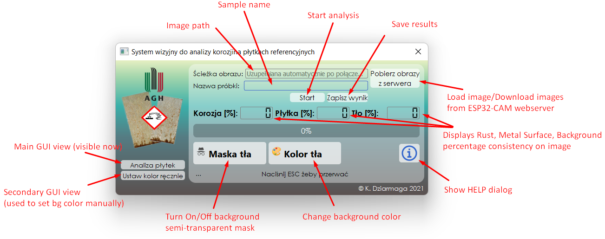
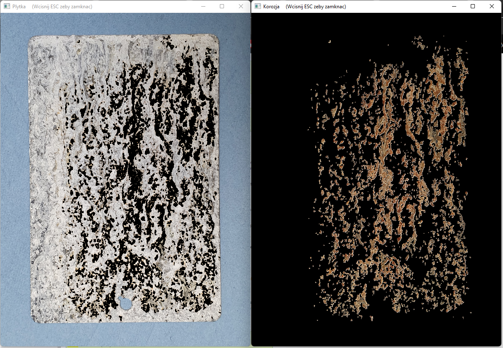
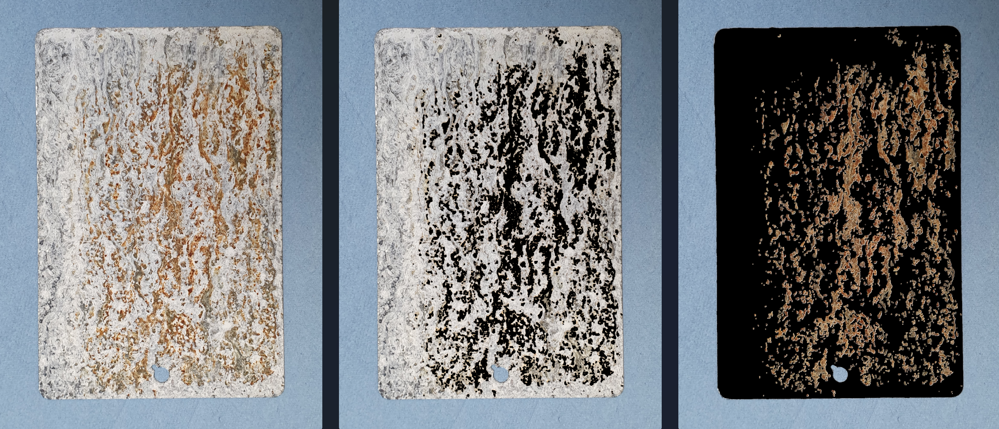
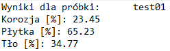
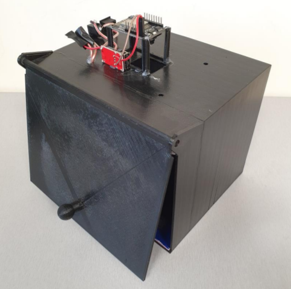

# Rust Detection Program
## Description & Presentation
This program is able to detect and calculate corrosion on metal plates surfaces which are used to calibrate salt chambers.

## Main GUI widget

## Analysis
After clicking "Start" button the following windows are shown, where graphical results of auto analysis are visible. From this place it is possible to add or subtract some corrosion manually.

## Results
The results from analysis are saved in two variants:
- graphical

  
- text

## Notes
This program is able to analyze local images as well as to communicate with external device (based on ESP32-CAM uC) to download the images directly from microcontroller's camera. In this configuration the program becomes a vision system. Microcontroller and the rest of electrical components are enclosed in 3D printed housing which allows to easily put the test specimen inside and separate it from the influence of external conditions (e.g. external light sources). The housing is shown below.

## SETUP
###1. Install modules used in project by command:
"python -m pip install -r requirements.txt"

###2. Run program from command line using: 
"python rust_exe.py"